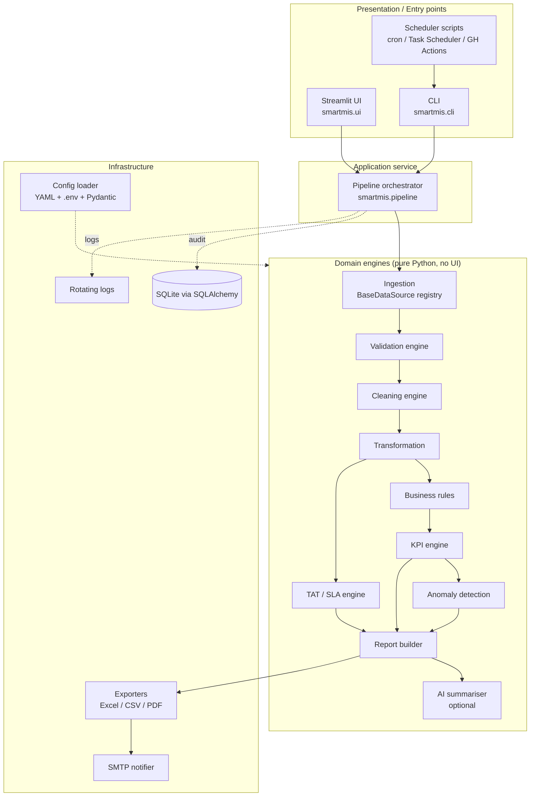
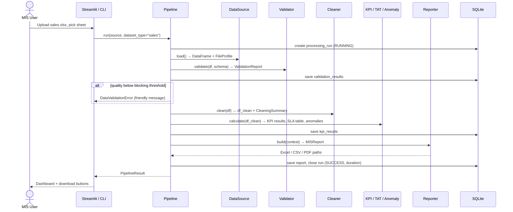
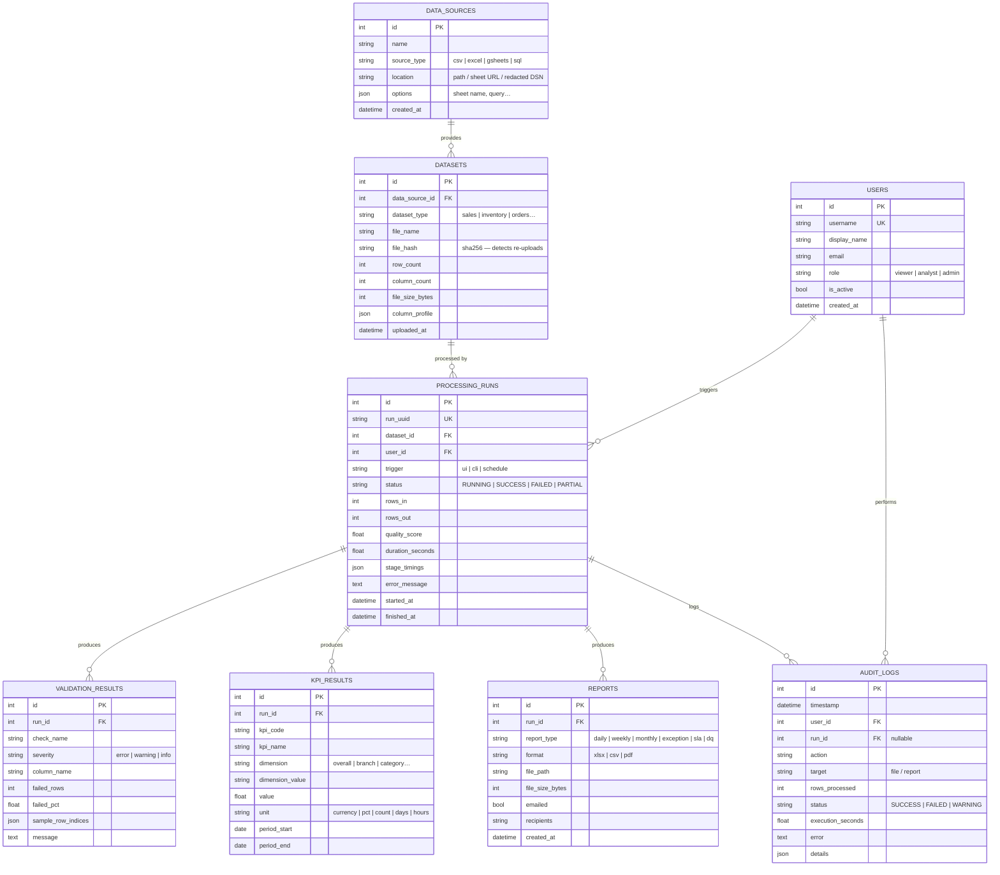

# SmartMIS — Architecture

> **SmartMIS — Intelligent MIS Automation & Analytics Platform**
> Phase 1 design document. This is the reference every later phase is built against.

---

## 1. Design goals

| Goal | How the architecture delivers it |
|---|---|
| Usable by a non-technical MIS user | Streamlit UI drives a guided 6-step workflow; every rule lives in readable YAML |
| Business logic independent of the UI | All logic lives in `smartmis.*` domain packages; `smartmis.ui` and `smartmis.cli` are thin adapters over one `Pipeline` service |
| No hardcoded business rules | `config/*.yaml` → validated by Pydantic models → injected into engines |
| Easy to extend | Registries (data sources, validation checks, KPIs, anomaly detectors, exporters) — add a class, register it, done |
| Handles 500k+ rows | Vectorised pandas only; no `iterrows`; TAT engine computed with NumPy array arithmetic; timings recorded per stage |
| Auditable | Every pipeline stage emits a `StageResult` that is persisted to SQLite and written to rotating logs |
| Safe by default | Secrets only via `.env`; upload type/size checks; uploaded files are parsed, never executed |

---

## 2. High-level architecture



**Layering rule:** arrows only point *inwards*. Domain engines never import `ui`, `cli`, or `database`. The pipeline is the only place that combines engines and persistence, which keeps every engine unit-testable with a plain DataFrame.

---

## 3. Data flow



Each stage returns an immutable result object (`FileProfile`, `ValidationReport`, `CleaningSummary`, `KPIResultSet`, `SLAResult`, `AnomalyResult`, `MISReport`). The UI renders these objects; it never recomputes anything.

---

## 4. Folder structure

The prompt's suggested `app/` layout is refined into a **`src/` layout** with an importable `smartmis` package. Reasons: `python -m smartmis.cli` works as requested, tests import the installed package (catching packaging errors), and the UI is just another sub-package.

```text
smart-mis/
├── src/smartmis/
│   ├── __init__.py              # version
│   ├── __main__.py              # python -m smartmis → CLI
│   ├── cli.py                   # Typer CLI: process, validate, clean, generate-report, send-report, run-all
│   │
│   ├── core/                    # cross-cutting, no business logic
│   │   ├── config.py            # Pydantic models + YAML/.env loader
│   │   ├── exceptions.py        # SmartMISError hierarchy
│   │   ├── logging.py           # rotating file + console logging
│   │   ├── paths.py             # project-relative paths
│   │   └── timing.py            # stage timer context manager
│   │
│   ├── ingestion/
│   │   ├── base.py              # BaseDataSource, FileProfile
│   │   ├── file_sources.py      # CSVDataSource, ExcelDataSource
│   │   ├── gsheets_source.py    # GoogleSheetsDataSource (optional extra)
│   │   ├── sql_source.py        # SQLDataSource (SQLAlchemy)
│   │   ├── profiling.py         # type detection, header detection
│   │   ├── security.py          # extension / size / magic-byte checks
│   │   └── registry.py          # source factory
│   │
│   ├── schemas/                 # dataset contracts (sales, inventory, orders…)
│   │   └── datasets.py
│   │
│   ├── validation/
│   │   ├── checks.py            # one class per check (missing, duplicates, dates…)
│   │   ├── engine.py            # runs checks, row-level issue mask
│   │   ├── scoring.py           # documented Data Quality Score
│   │   └── report.py            # ValidationReport + text rendering
│   │
│   ├── cleaning/
│   │   ├── operations.py        # trim, standardise, dedupe, coerce…
│   │   └── engine.py            # ordered pipeline + CleaningSummary / change log
│   │
│   ├── transformation/
│   │   └── enrich.py            # derived columns (net sales, margin, period keys)
│   │
│   ├── business_rules/
│   │   ├── models.py            # rule config models
│   │   └── engine.py            # flags exceptions (stockout, low margin, high value…)
│   │
│   ├── kpi/
│   │   ├── base.py              # KPIDefinition, KPIResult, registry decorator
│   │   ├── sales.py | inventory.py | margin.py | operations.py
│   │   └── engine.py            # evaluate registered KPIs, grouped by dimension
│   │
│   ├── tat/
│   │   ├── calendar.py          # BusinessCalendar (hours, days, holidays)
│   │   └── engine.py            # vectorised working-hours TAT + SLA status
│   │
│   ├── anomaly/
│   │   ├── base.py              # BaseDetector interface (ML-ready)
│   │   ├── detectors.py         # IQR, ZScore, RollingDeviation, PctChange
│   │   └── engine.py
│   │
│   ├── reporting/
│   │   ├── builder.py           # assembles MISReport sections
│   │   ├── excel_exporter.py    # formatted openpyxl workbook
│   │   ├── csv_exporter.py
│   │   └── pdf_exporter.py      # management summary (reportlab)
│   │
│   ├── notifications/
│   │   ├── email_sender.py      # SMTP, TLS, attachments
│   │   └── templates/mis_email.html  # Jinja2
│   │
│   ├── ai/
│   │   └── summarizer.py        # optional; works on aggregated results only
│   │
│   ├── database/
│   │   ├── models.py            # SQLAlchemy ORM tables
│   │   ├── session.py           # engine / session factory
│   │   └── repositories.py      # RunRepository, AuditRepository…
│   │
│   ├── audit/
│   │   └── logger.py            # AuditLogger → DB + log file
│   │
│   ├── pipeline/
│   │   ├── context.py           # PipelineContext, StageResult
│   │   └── orchestrator.py      # Pipeline.run_all() used by UI and CLI
│   │
│   └── ui/
│       ├── app.py               # Streamlit entry (streamlit run …/app.py)
│       ├── state.py             # typed session_state wrapper
│       ├── components/          # kpi_card, status_badge, header, filters, charts
│       ├── pages/               # 12 pages (home … settings)
│       └── styles/theme.css
│
├── config/
│   ├── settings.yaml            # app, paths, upload limits, calendar, anomaly
│   ├── business_rules.yaml
│   ├── validation_rules.yaml    # per-dataset schema + checks + score weights
│   └── kpi_definitions.yaml     # name, description, formula, business meaning
│
├── data/{sample,processed}/
├── reports/                     # generated output (git-ignored)
├── logs/                        # rotating logs (git-ignored)
├── scripts/
│   ├── generate_sample_data.py
│   ├── scheduled_run.py         # headless daily/weekly MIS
│   └── init_db.py
├── tests/{unit,integration}/ + conftest.py
├── docs/                        # 10 docs listed in the brief
├── .github/workflows/ci.yml
├── .env.example  .gitignore  Dockerfile  docker-compose.yml
├── pyproject.toml  requirements.txt  requirements-dev.txt
├── Makefile                     # make install | test | lint | run
├── README.md  LICENSE
```

---

## 5. Module responsibilities

| Module | Responsibility | Key public API | Extension point |
|---|---|---|---|
| `core.config` | Load & validate YAML + `.env` into typed objects | `load_config() -> AppConfig` | Add a Pydantic model + YAML section |
| `ingestion` | Read data, profile it, enforce upload safety | `BaseDataSource.load() -> LoadedData` | Subclass `BaseDataSource`, `@register_source` |
| `schemas` | Dataset contracts (required columns, types, business key) | `DatasetSchema` | Add a schema entry in `validation_rules.yaml` |
| `validation` | Detect problems **without modifying data** | `Validator.validate(df, schema)` | Subclass `BaseCheck` |
| `cleaning` | Apply explicit, logged fixes; produce before/after diff | `Cleaner.clean(df) -> (df, CleaningSummary)` | Add an operation function + config toggle |
| `transformation` | Derived fields (net sales, gross profit, period keys) | `enrich(df, dataset_type)` | — |
| `business_rules` | Flag exceptions from configurable thresholds | `RuleEngine.evaluate(df) -> ExceptionSet` | Add rule class + YAML block |
| `kpi` | Compute KPIs overall and by dimension | `KPIEngine.compute(df, group_by=...)` | `@kpi(...)` decorated function |
| `tat` | Working-hours TAT, SLA target/status, delay | `TATEngine.compute(df)` | Calendar config |
| `anomaly` | Flag *potential* anomalies with explanation | `AnomalyEngine.detect(series/df)` | Subclass `BaseDetector` (ML later) |
| `reporting` | Assemble report sections and export | `ReportBuilder.build(ctx)`, `ExcelExporter.export()` | Add exporter class |
| `notifications` | Send HTML email with attachments via SMTP | `EmailSender.send(report)` | Other channels (Teams/Slack) later |
| `ai` | Optional narrative over aggregated results | `AISummarizer.summarize(ctx)` | Provider interface |
| `database` | Persistence only — no business logic | Repositories | New table + repository |
| `audit` | Uniform audit trail | `AuditLogger.record(...)` | — |
| `pipeline` | Orchestrate stages, timing, error translation | `Pipeline.run_all()` | Add a stage |
| `ui` / `cli` | Presentation only | — | New page / command |

---

## 6. Database schema

SQLite by default (`sqlite:///data/smartmis.db`); any SQLAlchemy URL via `DATABASE_URL`.



Indexes: `processing_runs(started_at)`, `kpi_results(run_id, kpi_code)`, `audit_logs(timestamp)`, `datasets(file_hash)`.

---

## 7. Key algorithms (decided now so later phases are consistent)

### 7.1 Data Quality Score
A weighted average of per-dimension pass rates, with weights in `validation_rules.yaml`:

```
DQ Score = Σ ( wᵢ × (1 − failed_cellsᵢ / checked_cellsᵢ) ) / Σ wᵢ   × 100
```

| Dimension | Default weight | Measures |
|---|---|---|
| Completeness | 0.30 | non-null required cells |
| Validity | 0.25 | parseable dates/numbers, allowed categories, ranges |
| Uniqueness | 0.20 | rows not duplicated on business key |
| Consistency | 0.15 | rule checks (e.g. qty ≥ 0, 0 ≤ pct ≤ 100) |
| Conformity | 0.10 | schema: required columns present, no unexpected columns |

Conformity is the share of required columns present, and a missing required column is also a **blocking** error. Dimensions with nothing to check are excluded and the weights re-normalised. The score is reproducible; the full method and a worked example are in [`docs/validation-rules.md`](validation-rules.md).

### 7.2 Working-hours TAT (vectorised)
For each request, working seconds = `full working days between × day_length + partial first day + partial last day − holidays`, where timestamps are first **clamped** into working windows (before-hours → day start, after-hours/non-working day → next working day start). Business days are counted with `numpy.busday_count` using the configured weekmask and holiday array, so 500k rows compute in one array pass with no Python loop.

### 7.3 Anomaly detection
All detectors implement `BaseDetector.fit_detect(series) -> AnomalyFrame(score, is_anomaly, expected, deviation_pct, method)`. Output language is always *"Potential anomaly detected"*. An `IsolationForestDetector` can be added later with no engine change.

### 7.4 Error handling
```
SmartMISError
├── ConfigurationError
├── DataSourceError
│   └── UnsupportedFileError
├── DataValidationError
├── DataProcessingError
├── KPICalculationError
├── ReportGenerationError
└── NotificationError
```
Each carries a `user_message` (shown in the UI) and technical `details` (logged only).

---

## 8. Technology decisions

| Area | Choice | Why / notes |
|---|---|---|
| Language | Python 3.12 (3.11 compatible) | CI runs 3.11 + 3.12 |
| Data | pandas 2.2+, NumPy | Vectorised ops; pandas 3 compatible |
| Models/config | Pydantic v2 + pydantic-settings | Typed, validated config with friendly errors |
| Config files | YAML | Easiest for MIS analysts to read/edit |
| ORM | SQLAlchemy 2.0 | SQLite now, Postgres/MySQL via URL |
| UI | Streamlit multipage + custom CSS | Fast to build, enterprise styling via theme + components |
| Charts | Plotly | Interactive, consistent template |
| Excel | openpyxl | Full formatting control (freeze panes, CF, filters) |
| PDF | reportlab | Pure Python, Docker-friendly (no system deps) |
| Email templates | Jinja2 | HTML email with KPI tables |
| CLI | Typer | Typed commands, auto `--help` |
| Google Sheets | gspread + google-auth (optional extra `[gsheets]`) | App runs without it |
| AI | Provider interface; Anthropic SDK as optional extra `[ai]` | Disabled when no key |
| Quality | Ruff (lint + isort), Black, mypy | Enforced in CI |
| Tests | pytest + pytest-cov | Unit + integration |
| Container | Docker (slim, non-root) + compose | `docker compose up` |
| CI | GitHub Actions | lint → format check → type check → tests |

---

## 9. Development roadmap

| Phase | Deliverable | Acceptance check |
|---|---|---|
| 1 | Architecture (this document) | Reviewed |
| 2 | Foundation: packaging, config, exceptions, logging, paths | `pip install -e .`, config tests pass |
| 3 | Ingestion + profiling + upload security + sample data generator | Loads all sample CSV/XLSX sheets |
| 4 | Validation engine + DQ score; cleaning engine + change log | DQ report matches hand-calculated fixture |
| 5 | Business rules + KPI engine (sales, inventory, margin, ops) | KPI values match fixtures |
| 6 | TAT/SLA engine | Weekend / holiday / after-hours tests pass |
| 7 | Anomaly detection | Known injected anomalies detected |
| 8 | Streamlit dashboard (12 pages, filters, components) | Manual walkthrough of 12-step user journey |
| 9 | Report generation: Excel / CSV / PDF | Workbook opens with all 8 sheets formatted |
| 10 | Email automation + scheduled run script | Sends via local SMTP debug server |
| 11 | Database + audit logs wired into pipeline | Runs visible on Logs page |
| 12 | CLI | `run-all` produces reports headlessly |
| 13 | Test suite completion + coverage | `pytest` green |
| 14 | Docker + GitHub Actions | `docker compose up`, CI green |
| 15 | README + full docs | All sections in brief present |
